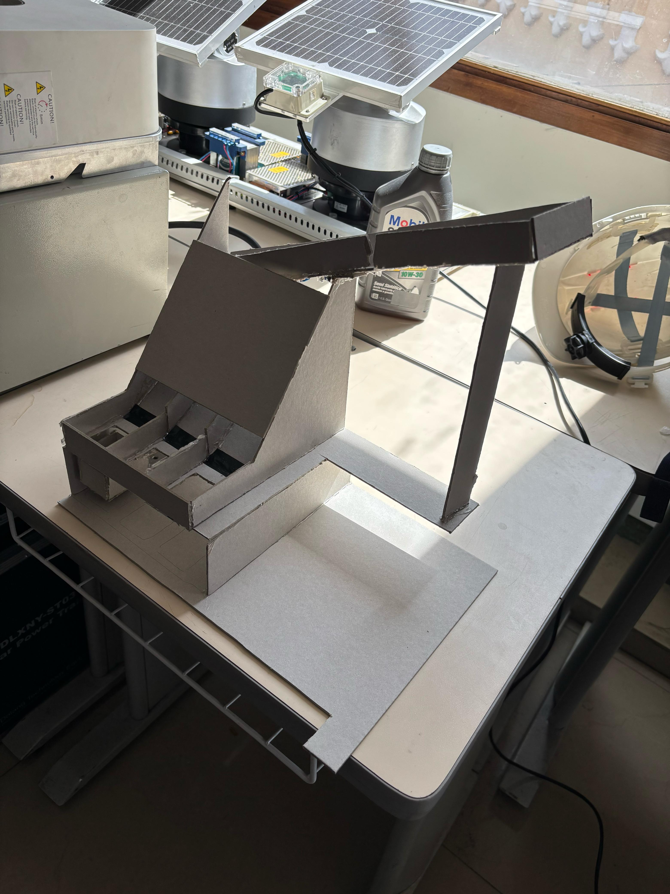
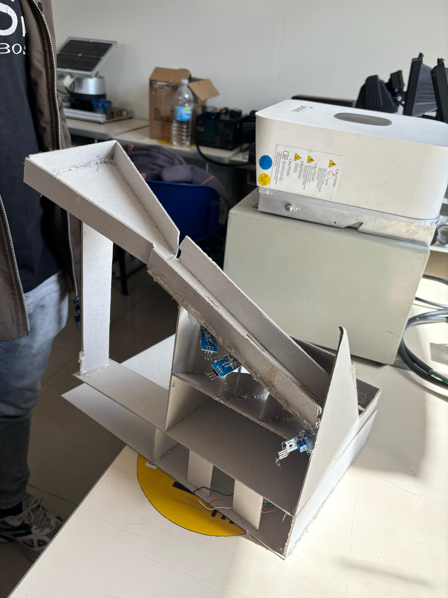
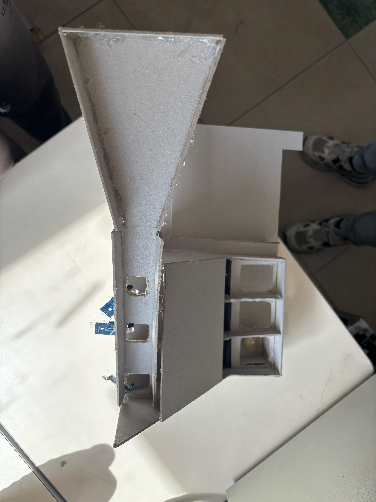

# Segunda-Entrega---Proyecto-IoT

# Recolector y Clasificador de Monedas IoT
Este proyecto consiste en el desarrollo de un sistema inteligente para la recolección, clasificación y monitoreo de monedas, implementado como parte de la asignatura de Internet de las Cosas (IoT). Utiliza sensores infrarrojos (IR), celdas de carga (HX711), comunicación inalámbrica y una simulación de movimiento automatizado para representar un entorno dinámico de transporte y parada de carga.

# Contenido del Repositorio
El repositorio contiene dos scripts principales, imágenes del prototipo implementado y documentación asociada al funcionamiento del sistema.

# Archivos "sensores.py"
Este código fue desarrollado en MicroPython para ejecutarse en un microcontrolador ESP8266, el cual se encarag de leer señales digitales de sensores infrarrojos para detectar la presencia de monedas en cada caja y el conteo correspondiente. También se mide el peso acumulado de las monedas usando como sensores de peso celdas de carga y un ADC HX711 y obtener la hora actual sincronizada por la red Wifi. Finalmente, se envían los datos de conteo y peso en tiempo real a una base de datos Firebase Realtime Database.

# Archivo "carrito.py"
Este archivo consiste en una simulación en Python usando tkinter, la cual consiste en un carrito autónomo que se desplaza entre paradas predefinidas; en cada parada, se detiene automáticamente y espera una confirmación del usuario para continuar. Para su funcionamiento se implementa un controlador PID para seguimiento de línea simulado.

# Imágenes del prototipo implementado.
Para el correcto desarrollo del proyecto establecido, se realizó la implementación de un prototipo físico (hardware) que permite la recolección, caída y clasificación de tres monedas de diferentes denominaciones ($50, $200 y $1000, antiguas y nuevas) y cada una de estas denominaciones tiene una caja.

